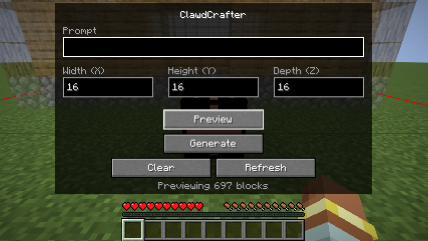
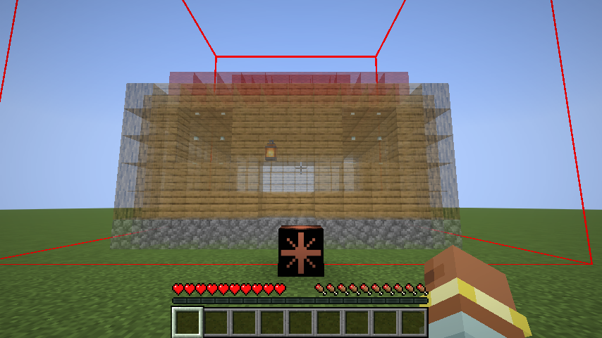
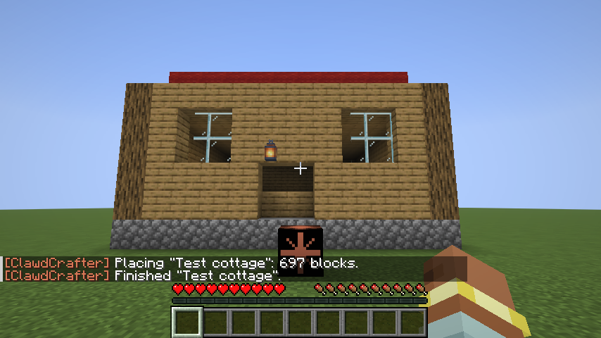

# ClawdCrafter

Minecraft mod that adds a single block that turns a written prompt into a 3D build, generated by Claude. The block has a simple interface: one prompt box and three size boxes (X × Y × Z, default 16 × 16 × 16). You first **preview** the build as see-through ghost blocks inside a red boundary, then **generate** it for real.

| Screen | Preview (ghost blocks + boundary) | After Generate |
|---|---|---|
|  |  |  |

These screenshots come from the client game test, which uses a hand-written test build instead of Claude.

## Requirements

| | Version |
|---|---|
| Minecraft (Java) | 26.3 |
| Fabric Loader | ≥ 0.19.5 |
| Fabric API | 0.161.0+26.3 or newer |
| Java | 25 |
| Anthropic API key | [console.anthropic.com](https://console.anthropic.com) |

The Anthropic Java SDK is bundled inside the mod jar, so you don't need to install anything else. The jar is about 35 MB because of this.

## Install

1. Install Fabric Loader and Fabric API for Minecraft 26.3.
2. Put `clawdcrafter-<version>.jar` in `mods/`. For multiplayer, install it on both the server and each client.
3. Launch once. This creates `config/clawdcrafter.json`.
4. Add your API key (see below) and restart.

## Configuration: `config/clawdcrafter.json`

This file is read on the **server**. In singleplayer, the integrated server reads it. The key is never sent to clients.

| Key | Default | Meaning |
|---|---|---|
| `apiKey` | `""` | Anthropic API key. If it's empty, the mod uses the `ANTHROPIC_API_KEY` environment variable. |
| `model` | `claude-sonnet-5-5` | The Claude model to use. Existing config files keep their old value; change it by hand. |
| `effort` | `medium` | `low` / `medium` / `high` / `xhigh` / `max`. Higher settings give more detailed builds but are slower and cost more. |
| `maxDimension` | `64` | Largest value allowed for each size box (capped at 128). |
| `blocksPerTick` | `1024` | How fast blocks are placed. Lower this if the server lags. |
| `clearVolume` | `true` | Fill the build volume with air before building. |
| `opOnly` | `false` | Only let operators use the block. Recommended on public servers, since every build costs API credits. |

## Usage

1. Get the block from the **Functional Blocks** creative tab, or craft it. The recipe is a placeholder: orange terracotta in the corners, black concrete on the edges, and a diamond in the center.
2. Place it, then right-click it. A **thin red outline** shows the volume the build can fill. It updates as you change X/Y/Z.
3. Type a prompt, e.g. *"a cozy oak cabin with a stone chimney"*. Adjust X/Y/Z if you want and press **Preview**.
4. After a short wait (usually tens of seconds), the build appears as **semi-transparent ghost blocks**. Only you can see them, and nothing is placed yet. Right-click the block again for:

| Button | Does |
|---|---|
| **Generate** | Places exactly the previewed build, with no second call to Claude. |
| **Clear** | Removes the ghost blocks. |
| **Refresh** | Asks Claude again with the same prompt, for a different take. |

The build goes **on the far side of the block, facing you**:

```
        [ build volume X × Y × Z ]   ← centered on the block, floor at the block's level
                  ▲
             [ClawdCrafter]
                  ▲
                 you (facing the block)
```

Chat messages tell you when a preview is ready, when a build is placed or finished, and about any errors. Each block remembers its last prompt and sizes.

## How it works

1. **UI** (`client/ClawdCrafterScreen`):
   - Right-clicking the block makes the server send `OpenScreen`.
   - **Preview** and **Refresh** send `RequestPreview`.
   - **Generate** sends `PlaceBuild`.
   - The packets are defined in `network/Payloads`.
2. **Validation** (`build/BuildService`): the server checks that the player is within reach and that the block isn't already busy. It also clamps the sizes and applies `opOnly`.
3. **Claude** (`ai/ClaudeBuilder`): a streaming request goes out through the official Anthropic Java SDK on a background thread. It uses **structured output**: the JSON schema comes from the `ai/BuildPlan` records, so the response always parses. It also uses **server-side refusal fallback** (`fallbacks: "default"`). Claude returns a list of `/fill`-style boxes: `block`, two corners, and `hollow`.
4. **Prepare** (`build/BuildPlacer.prepare`):
   - The boxes are drawn into a grid; later boxes overwrite earlier ones.
   - Block strings are parsed with vanilla `BlockStateParser`. Unknown blocks and operator-only blocks (command, structure, jigsaw) are skipped.
   - The block entity keeps the result as its pending build, and the server sends it to the player as a compact `Preview` packet.
5. **Preview** (`client/ClientPreview`, `client/PreviewRenderer`): the client draws the ghost blocks and the red boundary. Positions and rotation come from the shared `build/BuildVolume`, so the preview matches the real placement exactly.
6. **Place** (`build/BuildPlacer.enqueue`): **Generate** places the pending build, rotated to face the player and bottom-up, `blocksPerTick` at a time.

## Build from source

```bash
./gradlew build        # compiles, runs headless server game tests, jar in build/libs/
./gradlew runClient    # dev client
./gradlew runGameTest  # game tests only
./gradlew runClientGameTest  # real-client visual test; needs a display, not part of build
```

The game tests (`src/gametest`) don't need an API key. They check three things:
- Placement, rotation and block rejection, using a hand-written plan.
- That the preview packet survives encoding and matches the real placement and boundary.
- That the bundled SDK builds a request (schema, model, effort, fallbacks) and parses a response offline.

The client game test drives a real client through the whole flow and saves screenshots to `build/run/clientGameTest/screenshots`:
- It right-clicks the block to open the screen.
- It injects a test preview and checks that the ghost blocks appear.
- It presses **Clear**, then **Generate**, and checks that the blocks were placed.

On a headless Linux machine, run it with `xvfb-run -a ./gradlew runClientGameTest`. This needs Mesa's software Vulkan driver (`mesa-vulkan-drivers`).

## Project layout

```
src/main/java/com/clawdcrafter/
  ClawdCrafter.java            entrypoint: registration, networking, tick hook
  block/                       block + block entity (prompt, sizes, busy flag)
  network/Payloads.java        OpenScreen (S2C), Generate (C2S)
  ai/                          BuildPlan schema records, Claude request
  build/                       request handling, BuildVolume (shared placement math), rasterise/place
  config/ClawdConfig.java      config/clawdcrafter.json
src/client/java/.../client/    screen, preview state, ghost-block + boundary renderer
src/gametest/                  headless server tests
docs/PLAN.md                   research notes + implementation plan
```

## Placeholders and limitations

- **Texture**: a hand-drawn 16×16 orange spark on black (`assets/clawdcrafter/textures/block/clawdcrafter.png`). Swap it freely.
- **Recipe**: placeholder (`data/clawdcrafter/recipe/clawdcrafter.json`).
- There's no undo, no in-game config screen and no support for land-claim or protection mods.
- Builds can include any non-operator block, including TNT, lava and fire. Use `opOnly` on public servers.
- The preview is only on your client, and only one at a time.
- A pending preview is not saved: after a server restart, press Preview again.
- If the server restarts in the middle of a build, that build is dropped.
- Unfinished builds are not saved.
- No license has been chosen yet.
