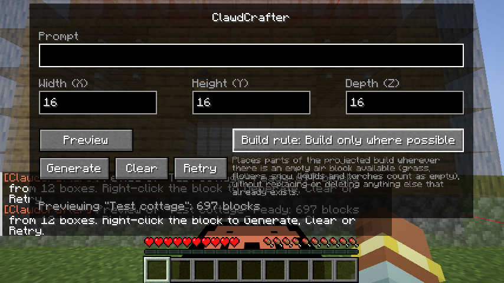

# ClawdCrafter

Minecraft mod that adds a single block that turns a written prompt into a 3D build, generated by Claude. The block has a simple interface: one prompt box and three size boxes (X × Y × Z, default 16 × 16 × 16). You first **preview** the build as see-through ghost blocks inside a red boundary, then **generate** it for real.

| Screen | Preview (ghost blocks + boundary) | After Generate |
|---|---|---|
|  |  |  |

These screenshots come from the client game test, which uses a hand-written test build instead of Claude.

## Requirements

| | Version |
|---|---|
| Minecraft (Java) | 26.3 |
| Fabric Loader | ≥ 0.19.5 |
| Fabric API | 0.161.0+26.3 or newer |
| Java | 25 |
| Anthropic API key | [console.anthropic.com](https://console.anthropic.com) |

The Anthropic Java SDK is bundled inside the mod jar, so you don't need to install anything else. The jar is about 35 MB because of this.

## Install

1. Install Fabric Loader and Fabric API for Minecraft 26.3.
2. Put `clawdcrafter-<version>.jar` in `mods/`. For multiplayer, install it on both the server and each client.
3. Launch once. This creates `config/clawdcrafter.json`.
4. Add your API key (see below) and restart.

## Configuration: `config/clawdcrafter.json`

This file is read on the **server**. In singleplayer, the integrated server reads it. The key is never sent to clients.

| Key | Default | Meaning |
|---|---|---|
| `apiKey` | `""` | Anthropic API key. If it's empty, the mod uses the `ANTHROPIC_API_KEY` environment variable. |
| `model` | `claude-sonnet-5-5` | The Claude model to use. Existing config files keep their old value; change it by hand. |
| `effort` | `medium` | `low` / `medium` / `high` / `xhigh` / `max`. Higher settings give more detailed builds but are slower and cost more. |
| `maxDimension` | `64` | Largest value allowed for each size box (capped at 128). |
| `blocksPerTick` | `1024` | How fast blocks are placed. Lower this if the server lags. |
| `opOnly` | `false` | Only let operators use the block. Recommended on public servers, since every build costs API credits. |

## Usage

1. Get the block from the **Functional Blocks** creative tab, or craft it. The recipe is a placeholder: orange terracotta in the corners, black concrete on the edges, and a diamond in the center.
2. Place it, then right-click it. A **thin red outline** shows the volume the build can fill. It updates as you change X/Y/Z.
3. Type a prompt, e.g. *"a cozy oak cabin with a stone chimney"*. Adjust X/Y/Z if you want and press **Preview**.
4. After a short wait (usually tens of seconds), the build appears as **semi-transparent ghost blocks**. Only you can see them, and nothing is placed yet. Right-click the block again for:

| Button | Does |
|---|---|
| **Generate** | Places exactly the previewed build, with no second call to Claude. |
| **Clear** | Removes the ghost blocks. |
| **Retry** | Asks Claude again with the same prompt, for a different take. |

The **Build rule** button, on the right of Preview, sets what Generate does with blocks already inside the volume. Click it to cycle between three rules. A short description of the current rule appears under the button. The block remembers your choice.

| Build rule | What Generate does |
|---|---|
| **Clear volume** (default) | Clears out all the blocks in the constraints and turns them to empty air before building. |
| **Replace blocks with build** | Makes the build completely but doesn't clear everything beforehand. It only replaces the existing blocks with the blocks that exist in the projected build, including the build's own open spaces such as room interiors and doorways. |
| **Build only where possible** | Places parts of the projected build wherever there is an empty air block available, without replacing or deleting anything that already exists. Air here also covers things you'd walk through or break by accident: grass, flowers, snow, liquids, torches and crops. |

The rule is applied when you press Generate, so you can switch rules after previewing without asking Claude again.

### What happens to things already in the build space

- **Blocks are broken, not deleted.** Every existing block that gets removed or replaced drops its normal loot, as if you had broken it by hand. That includes seeds from grass, torches and chest contents.
  - Everything is collected and merged into stacks, which pop out on top of the ClawdCrafter block when the build finishes.
  - Items already lying in the build space are collected the same way.
  - Liquids are simply replaced. Bedrock, portals, command blocks and other unbreakable blocks are never touched.
- **Falling blocks:** sand, gravel, anvils or concrete powder resting on the top edge of the build space are broken into items when the build would leave them unsupported. Anything that still falls into the site is caught and turned into an item.
- **Mobs, players, boats and minecarts** left inside new blocks are lifted to the nearest free space above. For example, a cow standing where the floor goes ends up standing on the floor.
- **Item frames and paintings** that lose the wall they hang on drop as items.
- **Lag protection:** if a huge clear (e.g. 64³ of solid stone) would drop more than 256 stacks, the most plentiful items are discarded first. The chat message says how many.



The build goes **on the far side of the block, facing you**:

```
        [ build volume X × Y × Z ]   ← centered on the block, floor at the block's level
                  ▲
             [ClawdCrafter]
                  ▲
                 you (facing the block)
```

Chat messages tell you when a preview is ready, when a build is placed or finished, and about any errors. Each block remembers its last prompt and sizes.

## How it works

1. **UI** (`client/ClawdCrafterScreen`):
   - Right-clicking the block makes the server send `OpenScreen`.
   - **Preview** and **Retry** send `RequestPreview`.
   - **Generate** sends `PlaceBuild`, which carries the preview's id and the build rule. The server only places the preview you actually saw; a newer preview made by someone else is refused. It confirms with `PreviewPlaced`, and only then do the ghosts disappear.
   - The packets are defined in `network/Payloads`.
2. **Validation** (`build/BuildService`):
   - The player must be within vanilla reach of the block and in a game mode that can build (not adventure or spectator).
   - The block mustn't already be busy.
   - Sizes are clamped and `opOnly` applies.
   - Each Claude request gets an id, so a late reply for a block that was broken or re-used is ignored.
3. **Claude** (`ai/ClaudeBuilder`): a streaming request goes out through the official Anthropic Java SDK on a background thread. It uses **structured output**: the JSON schema comes from the `ai/BuildPlan` records, so the response always parses. It also uses **server-side refusal fallback** (`fallbacks: "default"`). Claude returns a list of `/fill`-style boxes: `block`, two corners, and `hollow`.
4. **Prepare** (`build/BuildPlacer.prepare`):
   - The boxes are drawn into a grid; later boxes overwrite earlier ones. Cells no box touches are "not part of the build". Claude is asked to mark open spaces with explicit air boxes.
   - Block strings are parsed with vanilla `BlockStateParser`. Unknown blocks and operator-only blocks (command, structure, jigsaw) are skipped.
   - The grid is built and encoded off the server thread. The block entity keeps only the compact `Preview` (palette + run lengths, the same data sent to the player), and turns it back into a grid on Generate.
5. **Preview** (`client/ClientPreview`, `client/PreviewRenderer`): the client draws the ghost blocks and the red boundary. Positions and rotation come from the shared `build/BuildVolume`, so the preview matches the real placement exactly.
6. **Place** (`build/BuildPlacer.enqueue`): **Generate** places the pending build, rotated to face the player and bottom-up, `blocksPerTick` at a time.
   - Cells under spawn protection, outside the world border or in unloaded chunks are skipped and reported.
   - If the server stops mid-build, the build ends early and the items collected so far are still dropped. The `build/BuildRule` decides what happens to existing blocks:
   - **Clear volume**: cells outside the build become air.
   - **Replace**: cells outside the build are left alone.
   - **Only where possible**: a block is placed only if its spot is air (or grass, flowers, snow, a liquid, a torch...) when its turn comes.
   - Replaced blocks are broken into loot (`build/DropPool` merges it).
   - Gravity columns above the top edge are broken, falling blocks in the site are caught, stuck entities are lifted, and unsupported frames and paintings are dropped.

## Build from source

```bash
./gradlew build        # compiles, runs headless server game tests, jar in build/libs/
./gradlew runClient    # dev client
./gradlew runGameTest  # game tests only
./gradlew runClientGameTest  # real-client visual test; needs a display, not part of build
```

The game tests (`src/gametest`) don't need an API key. They check five things:
- Placement, rotation and block rejection, using a hand-written plan.
- Each build rule, against blocks already in the world, including broken blocks and chest contents dropping as items.
- Sand with an anvil on the top edge being broken instead of falling in, and a pig standing where the floor goes being lifted onto it.
- That the preview packet survives encoding and matches the real placement and boundary.
- That the bundled SDK builds a request (schema, model, effort, fallbacks) and parses a response offline.

The client game test drives a real client through the whole flow and saves screenshots to `build/run/clientGameTest/screenshots`:
- It right-clicks the block to open the screen.
- It injects a test preview and checks that the ghost blocks appear.
- It presses **Clear**, cycles through the build rules, then presses **Generate** and checks that the blocks were placed.

On a headless Linux machine, run it with `xvfb-run -a ./gradlew runClientGameTest`. This needs Mesa's software Vulkan driver (`mesa-vulkan-drivers`).

## Project layout

```
src/main/java/com/clawdcrafter/
  ClawdCrafter.java            entrypoint: registration, networking, tick hook
  block/                       block + block entity (prompt, sizes, busy flag)
  network/Payloads.java        OpenScreen (S2C), Generate (C2S)
  ai/                          BuildPlan schema records, Claude request
  build/                       request handling, BuildVolume (shared placement math), rasterise/place
  config/ClawdConfig.java      config/clawdcrafter.json
src/client/java/.../client/    screen, preview state, ghost-block + boundary renderer
src/gametest/                  headless server tests
docs/PLAN.md                   research notes + implementation plan
```

## Placeholders and limitations

- **Texture**: the Clawd mascot pixel-drawn at 16×16 on black (`assets/clawdcrafter/textures/block/clawdcrafter.png`). Swap it freely.
- **Recipe**: placeholder (`data/clawdcrafter/recipe/clawdcrafter.json`).
- There's no undo, no in-game config screen and no support for land-claim or protection mods.
- Builds can include any non-operator block, including TNT, lava and fire. Use `opOnly` on public servers.
- The preview is only on your client, and only one at a time.
- A pending preview is not saved: after a server restart, press Preview again.
- If the server restarts in the middle of a build, that build is dropped, along with any items collected so far.
- Unfinished builds are not saved.
- No license has been chosen yet.
